[](https://www.nf-test.com)
[](https://www.nextflow.io/)
[](https://docs.conda.io/en/latest/)
[](https://www.docker.com/)
[](https://sylabs.io/docs/)
[](https://cloud.seqera.io/launch?pipeline=https://github.com/CMOinn/rnainn)

<picture>
  <source media="(prefers-color-scheme: dark)" srcset="assets/RNAinn_logo_dark.svg">
  
</picture>

<picture>
  <source media="(prefers-color-scheme: dark)" srcset="assets/RNAinn_metro_dark.svg">
  
</picture>

## Introduction

**MSKCC/CTI/RNAinn** is an nf-core borne, production-ready and comprehensive bioinformatics pipeline for RNA sequencing data processing.

The pipeline processes paired-end RNA-seq data through multiple analysis modules including UMI processing, quality control, alignment, gene expression quantification, fusion detection and variant calling. RNAinn is designed to handle both standard RNA-seq workflows and specialized analyses for cancer genomics research.

The pipeline includes six main analysis tracks:

**Preprocessing**: Quality control, read trimming, and initial metrics collection
- Read QC with ([`FastQC`](https://www.bioinformatics.babraham.ac.uk/projects/fastqc/)) and ([`MultiQC`](http://multiqc.info/)) reporting
- Adapter trimming with FastP
- Read counting and sampling with Seqtk

**UMI Processing**: Molecular barcoding analysis with fgbio toolkit
- UMI correction and grouping
- Consensus read calling
- Error rate analysis and quality filtering

**Deduplication**: Molecular barcoding analysis with fgbio toolkit
- UMI correction and grouping
- Consensus read calling
- Error rate analysis and quality filtering

**Gene Expression**: Multiple quantification methods for comprehensive expression analysis
- STAR alignment with two-pass mode
- Transcript quantification with Kallisto, Salmon, StringTie, and RSEM
- Gene-level counting with FeatureCounts
- DESeq2-based quality control metrics

**Fusion Calling**: Multi-tool fusion detection and reporting
- Arriba fusion detection
- STAR-Fusion analysis
- FusionCatcher identification
- Integration of the calls with FusionReport
- FusionInspector validation
- Visualization with FusViz

**Variant Calling**: GATK-based somatic variant detection
- Duplicate marking and base quality score recalibration
- HaplotypeCaller for variant discovery
- Variant filtering and annotation with SNPeff and VEP
- Support for targeted sequencing intervals

The first track is mandatory but highly configurable e.g. the parameter --run_downsamplings set as True, will cap all your samples in the run to the lowest of them, usefull to comparative experiments, or you can set the number of downsampled reads with --ds_totalreads_aim. The rest are optional, you can enable those by setting to True the parameters --run_umiprocessing, --run_fusion_splice, --run_genexpression true, and run_variantdscvry the defaults are set to False so you can compose the run you need.

## Quick Start

Create a samplesheet with your input data:

`samplesheet.csv`:
```csv
sample,fastq_1,fastq_2,strandedness
SAMPLE_1,sample1_R1.fastq.gz,sample1_R2.fastq.gz,reverse
SAMPLE_2,sample2_R1.fastq.gz,sample2_R2.fastq.gz,reverse
```

Run the pipeline:

```bash
nextflow run CMOinn/rnainn \
   -profile <crater/juno/iris/singularity/docker> \
   --input samplesheet.csv \
   --outdir results \
   --genome GRCh38
```

## Usage

> [!NOTE]
> If you are new to Nextflow and nf-core, please refer to [this page](https://nf-co.re/docs/usage/installation) on how to set-up Nextflow. Make sure to [test your setup](https://nf-co.re/docs/usage/introduction#how-to-run-a-pipeline) with `-profile test` before running the workflow on actual data.

### Project Structure

The ideal structure would be like follows:

```
PROJECT/
├── 01_data/
│   ├── samples.csv
│   ├── SAMPLE1_TUMOUR_R1.fastq.gz
│   ├── SAMPLE1_TUMOUR_R2.fastq.gz
│   ├── SAMPLE1_NORMAL_R1.fastq.gz
│   ├── SAMPLE1_NORMAL_R2.fastq.gz
│   ├── SAMPLE2_TUMOUR_R1.fastq.gz
│   └── SAMPLE2_TUMOUR_R2.fastq.gz
├── 02_code/
│   └── run_DNAinn.sh
├── 03_outs/
├── 04_logs/
├── 05_work/
└── 06_cach/
```

Note: Any other structure is also possible, just adjust the launching script accordingly.

### Input Requirements

The pipeline requires a CSV samplesheet with the following columns:
- `sample`: Unique sample identifier
- `fastq_1`: Path to first read file (R1)
- `fastq_2`: Path to second read file (R2) 
- `strandedness`: Library strandedness (`forward`, `reverse`, or `unstranded`)

### Core Parameters

```bash
--input                 # Input samplesheet (required)
--outdir                # Output directory (required)
--genome                # Reference genome [default: GRCh38]
--seq_library           # Sequencing library type [default: Av1]
--seq_center            # Sequencing center [default: MSKCC_IGO]
```

### Analysis Modules

Enable specific analysis modules:

```bash
--run_genexpression     # Gene expression analysis [default: false]
--run_fusion_splice     # Fusion detection [default: false]
--run_variantdscvry     # Variant calling [default: false]
--run_umiprocessing     # UMI processing [default: false]
--run_copynumberalt     # Copy number analysis [default: false]
```

### Tool Selection

Control which tools to run:

```bash
--arriba                # Enable Arriba fusion caller [default: true]
--starfusion            # Enable STAR-Fusion [default: true]
--fusioncatcher         # Enable FusionCatcher [default: true]
--stringtie             # Enable StringTie [default: true]
--portcullis            # Enable Portcullis [default: true]
```

### Advanced Options

```bash
--star_twopass          # Enable STAR two-pass mode [default: true]
--fastp_trim            # Enable FastP trimming [default: true]
--remove_duplicates     # Remove duplicate reads [default: false]
--tools_cutoff          # Minimum tools for fusion filtering [default: 1]
--read_length           # Expected read length [default: 100]
```

### UMI Processing Options

```bash
--f2b_read_structure    # UMI read structure [default: '3M2S+T 3M2S+T']
--group_strategy        # UMI grouping strategy [default: 'edit']
--call_min_reads        # Minimum reads for consensus [default: 1]
--filter_min_reads      # Minimum reads for filtering [default: 2]
```

### Profiles

The pipeline includes several pre-configured profiles:

- `crater`: LSF cluster configuration for MSKCC Clinical Server (Crater)
- `juno`: LSF cluster configuration for MSKCC Research Server (Juno)
- `iris`: SLURM cluster configuration for MSKCC Research Server (Iris)
- `singularity`: Generic Singularity configuration ideal for most LSF HPC architectures 
- `docker`: Docker container execution ideal for local executions
- `conda`: Conda environment management not recomended unless extrictly necessary

## Output

The pipeline generates comprehensive outputs organized by analysis module:

```
03_outs/
├── fusion_splice/
│   ├── arriba/
│   ├── fusioncatcher/
│   ├── fusioninspector/
│   ├── fusionreport/
│   ├── fusviz/
│   ├── portcullis/
│   ├── starfusion/
│   └── vcf_collect/
├── genexpression/
│   ├── kallisto/
│   ├── rsem/
│   ├── salmon/
│   ├── star/
│   ├── stringtie/
│   └── subread/
├── pipeline_info/
│   ├── execution_report.html
│   ├── execution_timeline.html
│   ├── execution_trace.txt
│   ├── params.html
│   ├── pipeline_dag.html
│   ├── pipeline_report.html
│   └── pipeline_report.txt
├── preprocessing/
│   ├── align_con_bam/
│   ├── align_raw_bam/
│   ├── bamfiles/
│   ├── cat_fastq/
│   ├── collatefastq/
│   ├── downsampling/
│   ├── errorprofile/
│   ├── fastp/
│   ├── fastqc/
│   ├── fgbio/
│   ├── picard/
│   ├── preseq/
│   ├── splitreads/
│   └── umi_stats/
├── umi_processing/
│   ├── fgbio_consensus/
│   ├── error_correction/
│   └── quality_filtering/
├── statsnquality/
│   ├── dseq2/
│   ├── fastqc/
│   ├── multiqc/
│   ├── rsem/
│   └── variants/
└── variantdscvry/
    └── gatk4/
```

## System Requirements

### Computational Resources

Default resource limits (can be increased via parameters):
- Memory: 64 GB
- CPUs: 12 cores  
- Time: 24 hours

### Reference Data

The pipeline requires pre-built reference datasets including:
- STAR genome indices
- Kallisto/Salmon transcript indices
- GATK reference files (FASTA, VCF, intervals)
- Fusion detection databases (Arriba, STAR-Fusion, FusionCatcher)
- Annotation files (GTF, BED, RefFlat)

References are set and paths configured per-cluster in the profile configurations.

## Runnin the pipeline

RNAinn can be run by using this script as a template:

```bash
#!/bin/bash

source activate <conda env for nf-core>

export NXF_LOG_FILE="../04_logs/nextflow.log"
export NXF_CACHE_DIR="../06_cach/nextflow-cache"

nextflow run \
    /path/to/RNAinn/main.nf \
    --input ../01_data/samples.csv \
    --outdir ../03_outs/ \
    --email <user_name>@mskcc.org \
    -profile <crater/iris/juno/singularity/docker> \
    -work-dir ../05_work \
    --seq_library Av2 \
    --genome HG19VS \
    -resume
```

> [!WARNING]
> Please provide pipeline parameters via the CLI or Nextflow `-params-file` option. Custom config files including those provided by the `-c` Nextflow option can be used to provide any configuration _**except for parameters**_;
> see [docs](https://nf-co.re/usage/configuration#custom-configuration-files).

### Cluster Profiles

The pipeline includes optimized configurations for MSKCC compute clusters. Each profile sets appropriate:
- Job scheduler settings (LSF/SLURM)
- Container configurations  
- Reference data paths
- Resource allocations

## Troubleshooting

### Common Issues

**Memory errors**: Increase `--max_memory` parameter or use cluster profile
**Timeout errors**: Increase `--max_time` parameter  
**Missing references**: Ensure correct profile is selected for your cluster
**Tool failures**: Check individual tool logs in work directories

### Getting Help

For issues specific to RNAinn:
1. Check the pipeline documentation
2. Review error logs in the work directory
3. Contact the development team

For Nextflow-related issues:
- [Nextflow documentation](https://www.nextflow.io/docs/latest/)
- [nf-core help](https://nf-co.re/help)

## Credits and Citations

RNAinn was originally developed by the Technology Innovation Lab at the Marie-Josée and Henry R. Kravis Center for Molecular Oncology (CMO), Memorial Sloan Kettering Cancer Center (MSKCC).

**Lead Developer**: [Juan Blanco-Heredia](blancoj@mskcc.org)

We thank the following people for their extensive assistance in the development of this pipeline:

- [Caryn Hale](halec@mskcc.org)
- [Brian Loomis](loomisb@mskcc.org)

## Citations

An extensive list of references for the tools used by the pipeline can be found in the [`CITATIONS.md`](CITATIONS.md) file.

### Framework

This pipeline uses code and infrastructure developed by the [nf-core](https://nf-co.re) community, reused here under the [MIT license](https://github.com/nf-core/tools/blob/master/LICENSE).

> **The nf-core framework for community-curated bioinformatics pipelines.**
>
> Philip Ewels, Alexander Peltzer, Sven Fillinger, Harshil Patel, Johannes Alneberg, Andreas Wilm, Maxime Ulysse Garcia, Paolo Di Tommaso & Sven Nahnsen.
>
> _Nat Biotechnol._ 2020 Feb 13. doi: [10.1038/s41587-020-0439-x](https://dx.doi.org/10.1038/s41587-020-0439-x).

## License

This project is licensed under the MIT License - see the [LICENSE](LICENSE) file for details.