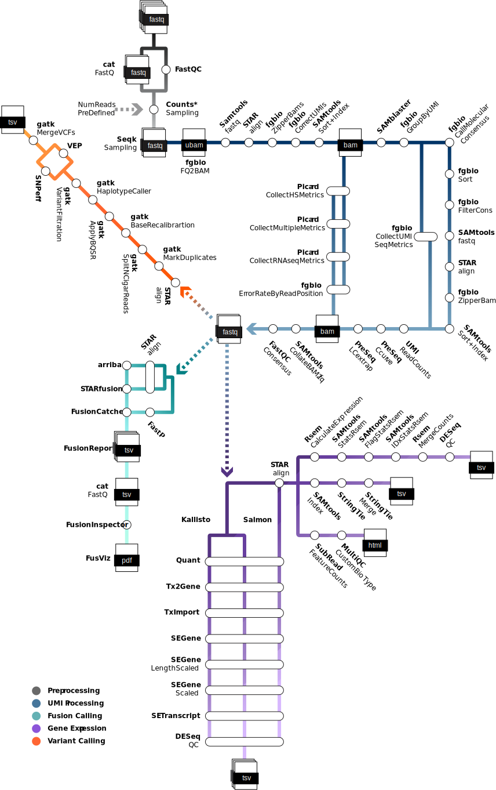

  <picture>
    <source media="(prefers-color-scheme: dark)" srcset="assets/RNAinn_logo_dark.svg">
    
  </picture>

[](https://www.nf-test.com)
[](https://www.nextflow.io/)
[](https://docs.conda.io/en/latest/)
[](https://www.docker.com/)
[](https://sylabs.io/docs/)
[](https://cloud.seqera.io/launch?pipeline=https://github.com/CMOinn/rnainn)

## Introduction

<picture>
  <source media="(prefers-color-scheme: dark)" srcset="assets/RNAinn_metro_dark.svg">
  
</picture>

**MSKCC/CTI/RNAinn** is an nf-core borne, production-ready and comprehensive bioinformatics pipeline for RNA sequencing data processing developed by the Technology Innovation group at the Marie-Josée and Henry R. Kravis Center for Molecular Oncology (CMO), Memorial Sloan Kettering Cancer Center (MSKCC).

The pipeline processes paired-end RNA-seq data through multiple analysis modules including UMI processing, quality control, alignment, gene expression quantification, fusion detection and variant calling. RNAinn is designed to handle both standard RNA-seq workflows and specialized analyses for cancer genomics research.

The pipeline includes five main analysis tracks:

**Preprocessing**: Quality control, read trimming, and initial metrics collection
- Read QC with FastQC and MultiQC reporting
- Adapter trimming with FastP
- Read counting and sampling with Seqtk

**UMI Processing**: Molecular barcoding analysis with fgbio toolkit
- UMI correction and grouping
- Consensus read calling
- Error rate analysis and quality filtering

**Deduplication**: Molecular barcoding analysis with fgbio toolkit
- UMI correction and grouping
- Consensus read calling
- Error rate analysis and quality filtering

**Gene Expression**: Multiple quantification methods for comprehensive expression analysis
- STAR alignment with two-pass mode
- Transcript quantification with Kallisto, Salmon, StringTie, and RSEM
- Gene-level counting with FeatureCounts
- DESeq2-based quality control metrics

**Fusion Calling**: Multi-tool fusion detection and reporting
- Arriba fusion detection
- STAR-Fusion analysis
- FusionCatcher identification
- Integration of the calls with FusionReport
- FusionInspector validation
- Visualization with FusViz

**Variant Calling**: GATK-based somatic variant detection
- Duplicate marking and base quality score recalibration
- HaplotypeCaller for variant discovery
- Variant filtering and annotation with SNPeff and VEP
- Support for targeted sequencing intervals

The first track is mandatory but highly configurable e.g. the parameter --run_downsamplings set as True, will cap all your samples in the run to the lowest of them, usefull to comparative experiments, or you can set the number of downsampled reads with --ds_totalreads_aim. The rest are optional, you can enable those by setting to True the parameters --run_umiprocessing, --run_fusion_splice, --run_genexpression true, and run_variantdscvry the defaults are set to False so you can compose the run you need.

1. Read QC ([`FastQC`](https://www.bioinformatics.babraham.ac.uk/projects/fastqc/))
2. Present QC for raw reads ([`MultiQC`](http://multiqc.info/))

## Usage

> [!NOTE]
> If you are new to Nextflow and nf-core, please refer to [this page](https://nf-co.re/docs/usage/installation) on how to set-up Nextflow. Make sure to [test your setup](https://nf-co.re/docs/usage/introduction#how-to-run-a-pipeline) with `-profile test` before running the workflow on actual data.

<!-- TODO nf-core: Describe the minimum required steps to execute the pipeline, e.g. how to prepare samplesheets.
     Explain what rows and columns represent. For instance (please edit as appropriate):

First, prepare a samplesheet with your input data that looks as follows:

`samplesheet.csv`:

```csv
sample,fastq_1,fastq_2
CONTROL_REP1,AEG588A1_S1_L002_R1_001.fastq.gz,AEG588A1_S1_L002_R2_001.fastq.gz
```

Each row represents a fastq file (single-end) or a pair of fastq files (paired end).

-->

Now, you can run the pipeline using:

<!-- TODO nf-core: update the following command to include all required parameters for a minimal example -->

```bash
nextflow run /path/to/rnainn \
   -profile <docker/singularity/.../institute> \
   --input samplesheet.csv \
   --outdir <OUTDIR>
```

> [!WARNING]
> Please provide pipeline parameters via the CLI or Nextflow `-params-file` option. Custom config files including those provided by the `-c` Nextflow option can be used to provide any configuration _**except for parameters**_;
> see [docs](https://nf-co.re/usage/configuration#custom-configuration-files).

## Credits

CMOinn/rnainn was originally written by blancoj@mskcc.org.

We thank the following people for their extensive assistance in the development of this pipeline:

<!-- TODO nf-core: If applicable, make list of people who have also contributed -->

## Contributions and Support

If you would like to contribute to this pipeline, please see the [contributing guidelines](.github/CONTRIBUTING.md).

## Citations

<!-- TODO nf-core: Add citation for pipeline after first release. Uncomment lines below and update Zenodo doi and badge at the top of this file. -->
<!-- If you use CMOinn/rnainn for your analysis, please cite it using the following doi: [10.5281/zenodo.XXXXXX](https://doi.org/10.5281/zenodo.XXXXXX) -->

<!-- TODO nf-core: Add bibliography of tools and data used in your pipeline -->

An extensive list of references for the tools used by the pipeline can be found in the [`CITATIONS.md`](CITATIONS.md) file.

This pipeline uses code and infrastructure developed and maintained by the [nf-core](https://nf-co.re) community, reused here under the [MIT license](https://github.com/nf-core/tools/blob/master/LICENSE).

> **The nf-core framework for community-curated bioinformatics pipelines.**
>
> Philip Ewels, Alexander Peltzer, Sven Fillinger, Harshil Patel, Johannes Alneberg, Andreas Wilm, Maxime Ulysse Garcia, Paolo Di Tommaso & Sven Nahnsen.
>
> _Nat Biotechnol._ 2020 Feb 13. doi: [10.1038/s41587-020-0439-x](https://dx.doi.org/10.1038/s41587-020-0439-x).
